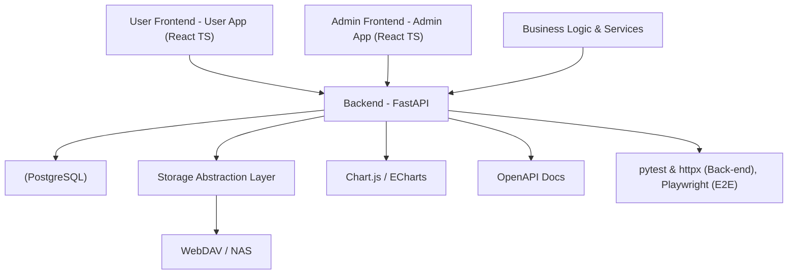

# 有声读物播放器 - 架构、快速开始与开发指南

本项目面向家庭场景，提供多用户的有声读物播放器系统，前端包含用户界面与管理员后台，后端基于 FastAPI，支持播放时长限制、播放统计等功能，同时具备可扩展的存储抽象层和多端部署能力。

## 项目简介
- 面向家庭服务器（如 NAS）部署，支持多用户权限、播放时长限制、播放数据统计等功能。
- 前后端分离，前端采用 React + TypeScript，后端使用 FastAPI + PostgreSQL/SQLite，数据通过 OpenAPI 文档暴露。
- 存储层支持 WebDAV 和本地挂载（SMB/CIFS, NFS），以实现对有声书内容的灵活访问。
- 通过 Docker + Docker Compose 进行部署，便于本地开发与生产环境的迁移。

## 技术栈
- 后端: FastAPI (Python)
- 前端: React + TypeScript
- UI:DUI: Material-UI (MUI)
- 数据库: PostgreSQL（生产）/ SQLite（开发）
- 部署: Docker + Docker Compose
- 认证: JWT with refresh tokens
- 存储: WebDAV + 本地挂载（SMB/CIFS, NFS）
- API 文档: OpenAPI（自动生成）
- 图表库: Chart.js 或 ECharts
- 测试: pytest + httpx（后端），Playwright（前端 E2E）

## 架构图
以下图示展示了系统各组件之间的关系（Mermaid 与 ASCII 两种表达形式均可参考）：

Mermaid 架构图


ASCII 版本
```
+-----------------+        +-----------------+        +----------------+ 
| User Frontend   | -----> | Backend API     | -----> | PostgreSQL/    |
| (User App)      |        |                 |        | SQLite         |
+-----------------+        +-----------------+        +----------------+ 
        |                          |                               
        |                          |                               
+-----------------+        +-----------------+        +----------------+ 
| Storage Layer   | <----  | WebDAV NAS      |        |  Content        |
| Abstraction     |        +-----------------+        |  Metadata       |
+-----------------+                               +----------------+ 
```

## 快速开始
前提: 已安装 Docker 与 Docker Compose。

1. 复制示例环境配置（如果需要）并创建本地环境变量文件
- 复制并编辑 infra/.env.example（若存在）或在项目根下创建 .env，按需求配置数据库、JWT、存储等变量。

2. 启动本地开发/测试环境
- 进入项目根目录，执行
  docker-compose up -d --build

3. 访问服务
- 前端 UI: http://localhost:3000 (若前端容器映射到该端口)
- 后端 API: http://localhost:8000/docs  或 http://localhost:8000/openapi.json

4. 运行测试
- 后端单元测试: cd backend && pytest
- 前端端到端测试: cd frontend && npx playwright test

> 备注：具体端口映射请以 infra/docker-compose.yml 的配置为准，必要时可调整环境变量和挂载点。

## 开发指南
- 目录结构遵循 Monorepo 最佳实践：backend、frontend、infra、docs、agile 指南等。
- 代码风格与提交规范请参考 docs/CODING_GUIDE.md。
- 测试优先，确保提交前通过基本用例与静态检查。
- 变更记录以原子提交为原则，确保每次提交都可追溯并能单独回滚。

## 部署说明
- 开发/测试环境：使用 docker-compose.yaml 启动即可，支持本地 PostgreSQL 或 SQLite。
- 生产环境：使用 docker-compose.prod.yml 或自定义 Kubernetes 方案，需配置安全证书、数据库、对象存储等。
- 备份与恢复：对 PostgreSQL 数据库定期备份，存储层内容遵循 NAS 备份策略。

## 结构概览
- backend/        # 后端服务
- frontend/       # 前端应用（monorepo）
- infra/          # 部署与基础设施配置
- docs/           # 文档
- AGENTS.md       # 代理工作流指南
- REQUIREMENTS.md # 需求文档
- IMPLEMENTATION_PLAN.md # 实现计划
- README.md       # 当前文档

> 贡献与支持：如遇问题，请在 Issue 中提交，我们将按贡献指南处理。

欢迎参与实现与改进！
