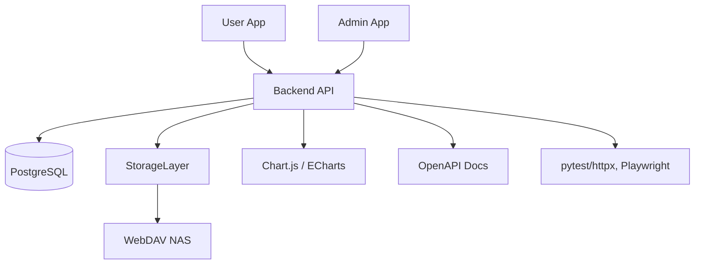

# 架构概要

系统采用前后端分离，核心组件及交互如下：

- 前端用户界面（User App）与管理员界面（Admin App）: React + TypeScript，UI 框架为 Material-UI。
- 后端服务: FastAPI 提供 REST/OpenAPI，负责业务逻辑、认证、权限、数据访问与业务流程。
- 数据库: PostgreSQL（生产环境）用于持久化数据，SQLite（开发/测试）用于本地快速迭代。
- 存储抽象层: 提供对内容存储的统一访问接口，支持 WebDAV（NAS）与本地挂载（SMB/CIFS, NFS）
- 认证: JWT（带 refresh token）实现短期访问令牌与刷新机制。
- 部署: Docker + Docker Compose，方便本地开发、测试与生产部署。
- API 文档: OpenAPI，自动从代码生成。
- 图表库: Chart.js 或 ECharts，用于播放数据可视化。
- 测试: pytest + httpx（后端单元与集成测试），Playwright（前端端到端测试）。

## 组件关系图 (Mermaid)

## 设计要点
- 关注点分离：各组件职责单一，接口清晰。
- 存储抽象层解耦内容访问与具体实现（WebDAV、本地挂载）。
- 安全性：JWT、合理的令牌生命周期、CSRF 保护、输入校验。
- 可部署性：Docker 化，便于本地开发及生产环境迁移。
