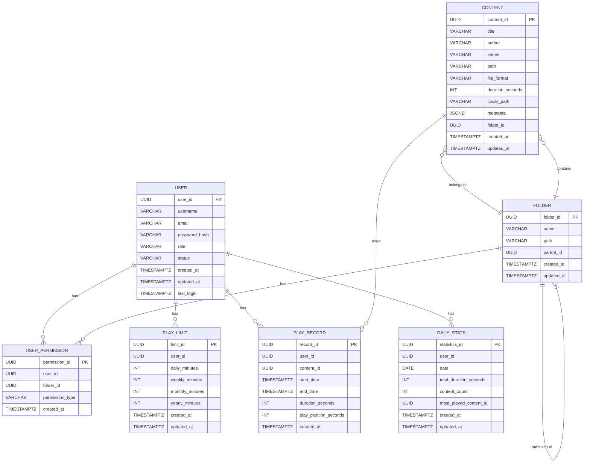

# 数据模型设计文档 - 有声读物播放器

本文档给出后端数据库的数据模型设计，覆盖用户、内容、文件夹、权限、播放限额、播放记录以及每日统计等核心实体。采用 PostgreSQL 兼容的设计思路，字段类型采用通用、可扩展的约束，便于后续 ORM 映射（如 SQLAlchemy）和迁移工具（Alembic）使用。所有时间字段统一使用 TIMESTAMPTZ（带时区的时间戳）。

## 1) ER 图（Mermaid 语法）
下述 Mermaid 语法可直接在 Mermaid 支持的环境中渲染成 ER 图。请将以下代码粘贴到文档或代码库中的 Mermaid 渲染区域以查看图形。 



> 注：Mermaid 的自引用关系在图形渲染时可能显示为“subfolder of”。如需更丰富的自引用说明，也可在段落中用 ASCII 方式补充。 

---

## 2) 表结构与字段设计
以下给出每张表的字段、数据类型、约束、以及索引建议。表名统一采用小写下划线命名以便 ORM 映射。

### 2.1 users
- 说明：系统注册用户，分为 user/admin，支持鉴权、角色与状态管理。
- 字段：
  - user_id: UUID PRIMARY KEY
  - username: VARCHAR(150) NOT NULL UNIQUE
  - email: VARCHAR(254) NOT NULL UNIQUE
  - password_hash: VARCHAR(255) NOT NULL
  - role: VARCHAR(20) NOT NULL CHECK (role IN ('user','admin'))
  - status: VARCHAR(20) NOT NULL CHECK (status IN ('active','disabled'))
  - created_at: TIMESTAMPTZ NOT NULL DEFAULT now()
  - updated_at: TIMESTAMPTZ NOT NULL DEFAULT now()
  - last_login: TIMESTAMPTZ
- DDL 示例：
  ```sql
  CREATE TABLE users (
    user_id UUID PRIMARY KEY DEFAULT gen_random_uuid(),
    username VARCHAR(150) NOT NULL UNIQUE,
    email VARCHAR(254) NOT NULL UNIQUE,
    password_hash VARCHAR(255) NOT NULL,
    role VARCHAR(20) NOT NULL CHECK (role IN ('user','admin')),
    status VARCHAR(20) NOT NULL CHECK (status IN ('active','disabled')),
    created_at TIMESTAMPTZ NOT NULL DEFAULT NOW(),
    updated_at TIMESTAMPTZ NOT NULL DEFAULT NOW(),
    last_login TIMESTAMPTZ
  );
  ```
- 索引：唯一索引 on (username), (email) 已定义。通常对 password_hash、created_at 也可添加常用查询索引（视查询模式而定）。

### 2.2 contents
- 说明：音视频内容条目，聚合元数据，归属于文件夹。
- 字段：
  - content_id: UUID PRIMARY KEY
  - title: VARCHAR(255) NOT NULL
  - author: VARCHAR(255)
  - series: VARCHAR(255)
  - path: TEXT NOT NULL  -- NAS 上的实际存放路径
  - file_format: VARCHAR(20)
  - duration_seconds: INT
  - cover_path: TEXT
  - metadata: JSONB
  - folder_id: UUID REFERENCES folders(folder_id) ON DELETE SET NULL
  - created_at: TIMESTAMPTZ NOT NULL DEFAULT now()
  - updated_at: TIMESTAMPTZ NOT NULL DEFAULT now()
- DDL 示例：
  ```sql
  CREATE TABLE contents (
    content_id UUID PRIMARY KEY DEFAULT gen_random_uuid(),
    title VARCHAR(255) NOT NULL,
    author VARCHAR(255),
    series VARCHAR(255),
    path TEXT NOT NULL,
    file_format VARCHAR(20),
    duration_seconds INT,
    cover_path TEXT,
    metadata JSONB,
    folder_id UUID REFERENCES folders(folder_id) ON DELETE SET NULL,
    created_at TIMESTAMPTZ NOT NULL DEFAULT NOW(),
    updated_at TIMESTAMPTZ NOT NULL DEFAULT NOW()
  );
  ```
- 索引：
  - INDEX on (folder_id)
  - INDEX on (title, author)  -- 搜索场景
  - GIN on metadata for JSONB queries

### 2.3 folders
- 说明：内容目录层级，支持自引用父文件夹。
- 字段：
  - folder_id: UUID PRIMARY KEY
  - name: VARCHAR(255) NOT NULL
  - path: TEXT NOT NULL UNIQUE
  - parent_id: UUID REFERENCES folders(folder_id)
  - created_at: TIMESTAMPTZ NOT NULL DEFAULT now()
  - updated_at: TIMESTAMPTZ NOT NULL DEFAULT now()
- DDL 示例：
  ```sql
  CREATE TABLE folders (
    folder_id UUID PRIMARY KEY DEFAULT gen_random_uuid(),
    name VARCHAR(255) NOT NULL,
    path TEXT NOT NULL UNIQUE,
    parent_id UUID REFERENCES folders(folder_id),
    created_at TIMESTAMPTZ NOT NULL DEFAULT NOW(),
    updated_at TIMESTAMPTZ NOT NULL DEFAULT NOW()
  );
  ```
- 索引：
  - INDEX on (parent_id)
  - UNIQUE (path) 以避免不同分支产生同名路径冲突

### 2.4 user_permissions
- 说明：用户对文件夹的访问权限，配合文件夹的层级权限管理。
- 字段：
  - permission_id: UUID PRIMARY KEY
  - user_id: UUID REFERENCES users(user_id) ON DELETE CASCADE
  - folder_id: UUID REFERENCES folders(folder_id) ON DELETE CASCADE
  - permission_type: VARCHAR(10) NOT NULL CHECK (permission_type IN ('read','write'))
  - created_at: TIMESTAMPTZ NOT NULL DEFAULT now()
- DDL 示例：
  ```sql
  CREATE TABLE user_permissions (
    permission_id UUID PRIMARY KEY DEFAULT gen_random_uuid(),
    user_id UUID REFERENCES users(user_id) ON DELETE CASCADE,
    folder_id UUID REFERENCES folders(folder_id) ON DELETE CASCADE,
    permission_type VARCHAR(10) NOT NULL CHECK (permission_type IN ('read','write')),
    created_at TIMESTAMPTZ NOT NULL DEFAULT NOW()
  );
  ```
- 索引：
  - UNIQUE (user_id, folder_id) 约束同一用户对同一文件夹只能有一种权限
  - INDEX on (user_id), (folder_id)

### 2.5 play_limits
- 说明：用户的播放时长限制，支持全局默认与逐用户覆盖。
- 字段：
  - limit_id: UUID PRIMARY KEY
  - user_id: UUID REFERENCES users(user_id)  -- NULL 表示全局默认
  - daily_minutes: INT
  - weekly_minutes: INT
  - monthly_minutes: INT
  - yearly_minutes: INT
  - created_at: TIMESTAMPTZ NOT NULL DEFAULT now()
  - updated_at: TIMESTAMPTZ NOT NULL DEFAULT now()
- DDL 示例：
  ```sql
  CREATE TABLE play_limits (
    limit_id UUID PRIMARY KEY DEFAULT gen_random_uuid(),
    user_id UUID REFERENCES users(user_id),
    daily_minutes INT NOT NULL,
    weekly_minutes INT,
    monthly_minutes INT,
    yearly_minutes INT,
    created_at TIMESTAMPTZ NOT NULL DEFAULT NOW(),
    updated_at TIMESTAMPTZ NOT NULL DEFAULT NOW()
  );
  ```
- 索引：
  - Unique partial index on (user_id) WHERE user_id IS NOT NULL 以确保每个用户只有一个自定义限制
  - INDEX on (user_id)

### 2.6 play_records
- 说明：播放记录，记录用户对内容的实际播放行为。
- 字段：
  - record_id: UUID PRIMARY KEY
  - user_id: UUID REFERENCES users(user_id) NOT NULL
  - content_id: UUID REFERENCES contents(content_id) NOT NULL
  - start_time: TIMESTAMPTZ NOT NULL
  - end_time: TIMESTAMPTZ NOT NULL
  - duration_seconds: INT NOT NULL
  - play_position_seconds: INT NOT NULL
  - created_at: TIMESTAMPTZ NOT NULL DEFAULT now()
- DDL 示例：
  ```sql
  CREATE TABLE play_records (
    record_id UUID PRIMARY KEY DEFAULT gen_random_uuid(),
    user_id UUID REFERENCES users(user_id) NOT NULL,
    content_id UUID REFERENCES contents(content_id) NOT NULL,
    start_time TIMESTAMPTZ NOT NULL,
    end_time TIMESTAMPTZ NOT NULL,
    duration_seconds INT NOT NULL,
    play_position_seconds INT NOT NULL,
    created_at TIMESTAMPTZ NOT NULL DEFAULT NOW()
  );
  ```
- 索引：
  - INDEX on (user_id)
  - INDEX on (content_id)
  - INDEX on (user_id, start_time)

### 2.7 daily_stats
- 说明：用户每日统计，聚合日常播放情况。
- 字段：
  - statistics_id: UUID PRIMARY KEY
  - user_id: UUID REFERENCES users(user_id) NOT NULL
  - date: DATE NOT NULL
  - total_duration_seconds: INT NOT NULL
  - content_count: INT NOT NULL
  - most_played_content_id: UUID REFERENCES contents(content_id)
  - created_at: TIMESTAMPTZ NOT NULL DEFAULT now()
  - updated_at: TIMESTAMPTZ NOT NULL DEFAULT now()
- DDL 示例：
  ```sql
  CREATE TABLE daily_stats (
    statistics_id UUID PRIMARY KEY DEFAULT gen_random_uuid(),
    user_id UUID REFERENCES users(user_id) NOT NULL,
    date DATE NOT NULL,
    total_duration_seconds INT NOT NULL,
    content_count INT NOT NULL,
    most_played_content_id UUID REFERENCES contents(content_id),
    created_at TIMESTAMPTZ NOT NULL DEFAULT NOW(),
    updated_at TIMESTAMPTZ NOT NULL DEFAULT NOW()
  );
  ```
- 索引：
  - INDEX on (user_id, date)  -- 按日汇总查询
  - INDEX on (most_played_content_id)

---

## 3) 数据类型与约束要点
- 主键：统一使用 UUID（content_id, user_id, folder_id 等）以便跨服务与分布式部署。
- 时间：TIMESTAMPTZ，确保跨时区的一致性。
- 时长：优先使用 INT（秒）来存储时长，必要时可用 INTERVAL 演算。示例中推荐使用 duration_seconds、total_duration_seconds 等整型字段。
- 元数据：Content.metadata 使用 JSONB，方便扩展字段而无需改变表结构。
- 状态/角色：使用 VARCHAR+CHECK 或 ENUM（若数据库支持，推荐 ENUM 创建以便约束）。本文以 VARCHAR + CHECK 为通用实现。

---

## 4) 索引策略与规范
- 主键索引：所有主键字段自带唯一索引。
- 外键索引：外键列应有索引以提升连接查询性能（如 user_id、content_id、folder_id 等）。
- 唯一约束索引：用户名、邮箱为唯一；以及 user_permissions 的 (user_id, folder_id) 的唯一性。
- 查询优化索引：根据查询模式，逐步添加合适的组合索引，例如 (user_id, date) 或 (content_id, start_time) 等。
- JSONB 查询：对 metadata 适用GIN索引，提升元数据字段的查询效率。

---

## 5) 设计假设与决策要点
- 用户安全：password_hash 使用 bcrypt，密码相关字段仅存储哈希，不存明文。
- 删除策略：外键采用 RESTRICT/NO ACTION 以防数据丢失；必要时通过业务逻辑实现软删除。
- 数据库迁移：后续通过 Alembic 进行版本化迁移，确保向后兼容性。
- 全局默认限额：PlayLimit 支持对所有用户的全局默认值，以及逐用户覆盖的单独记录。 用户的全局默认记录以 user_id 为 NULL 表示。

---

## 6) 验收要点对照
- 文档完整性：覆盖 7 张表及其关系、字段含义与索引策略。
- ER 图清晰： Mermaid ER 图清晰展示实体及关系。若需要，可附加更详细的 ASCII 版本。
- 表关系正确性：所有外键关系均在文档中列出并在 DDL 示例中体现。
- 数据类型合理性：UUID、TIMESTAMPTZ、JSONB、INT 等符合常见实现。
- 索引策略明确：主键、唯一、外键及常用查询的索引均有建议。

---

## 7) 下一步
- 基于本档案，使用 ORM（如 SQLAlchemy）生成模型类与 Alembic 迁移脚本。
- 与前端/后端实现对齐，确保 API 层对该数据模型的 CRUD 需求满足。
- 逐步完善测试用例和数据迁移方案。
